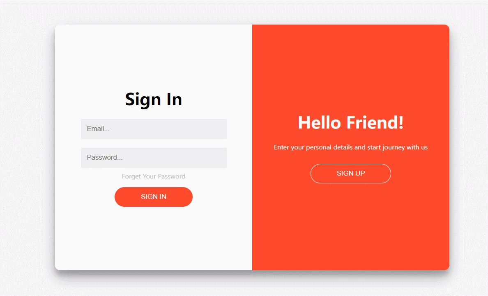

# Glong简单的登录注册页面
## 框架
简单的golang+gin+gorm,Mysql保存用户数据，Redis保存验证码，邮件验证码发送使用gomail实现，前后端分离。
## 配置文件
```
[common]
    orgin ="http://127.0.0.1"
    port = "8080" 

[mysql]
    host = "127.0.0.1"
    port = "3306"
    username= ""
    password= ""
    method="tcp"
    database="userdata"
    config="charset=utf8mb4&parseTime=True&loc=Local"  

[rdis]
    host = "127.0.0.1"
    port = "6379"
    db = 0
    password = ""
    method ="tcp"
    MaxIdle = 200
    MaxActive = 100
    Wait = true
    IdleTimeout = 1

[email]
    host = "smtp.qq.com"
    port = 25
    username = ""
    password = ""
    expires = 500

[jwt]
    expires = 604800 # token过期时间 (7 day)
    issuer = "hackerxiao" # 发行人
    key = "hackerxiaox" # 签名密钥
```
